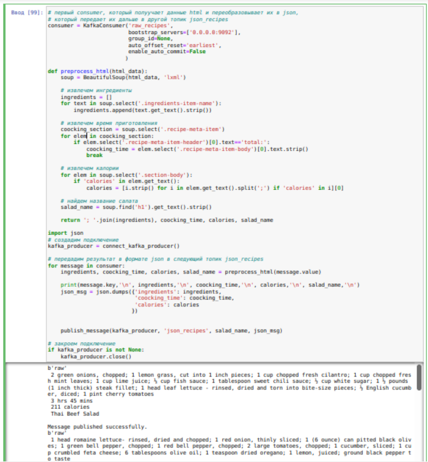

In this project we will explore how to use kafka and python. 

In our example we will parse a culinary site and use its information in transfer between kafka topics with some transformations. We will do all consumers, producers and transformation using python.     

To run all services together we I will use ["cp-all-in-one by Confluent"](https://github.com/confluentinc/cp-all-in-one)

* [first, we will clone kafka and services repo and build images](#sec1) 
* [then install kafka tools to control our kafka-cluster](#sec2)
* [finally, we will create all necessary python code and work with kafka](#sec3)

<a name="sec1"/>

### first, we will clone kafka and services repo and build images

first, let's install docker-compose

<xml/>

    sudo apt-get install docker-compose

The easiest way to run all services we need is ["cp-all-in-one by Confluent"](https://github.com/confluentinc/cp-all-in-one), let's clone it

<xml/>

    git clone https://github.com/confluentinc/cp-all-in-one

start all services

<xml/>

    sudo docker-compose up -d

..

check running containers

<xml/>

    sudo docker-compose ps

<a name="sec2"/>

### then install Kafka Tools to control our kafka-cluster

download kafka Tool

<xml/>

    wget https://www.kafkatool.com/download2/offsetexplorer.sh

install Java developer utilities

<xml/>

    sudo apt install openjdk-8-jre

install Kafka Tool

<xml/>

    chmod +x offsetexplorer.sh
    sudo ./offsetexplorer.sh

<a name="sec3"/>

### finally, we will create all necessary python code and work with kafka

##### all code is in ["kafka-python.ipynb"](kafka-python.ipynb), below I will show some screenshots

create producer and send 2 messages

check our messages in Kafka Tool

start consumer which will listen to the test_topic and print values from received messages

we will parse a website with recipes, pick up salad recipes, add html to a kafka topic, convert it to json format and transfer it to another topic (json_recipes), the next consumer will pick up information about calorie content, a list of ingredients and cooking time, it will also issue an alert if calories above the threshold

